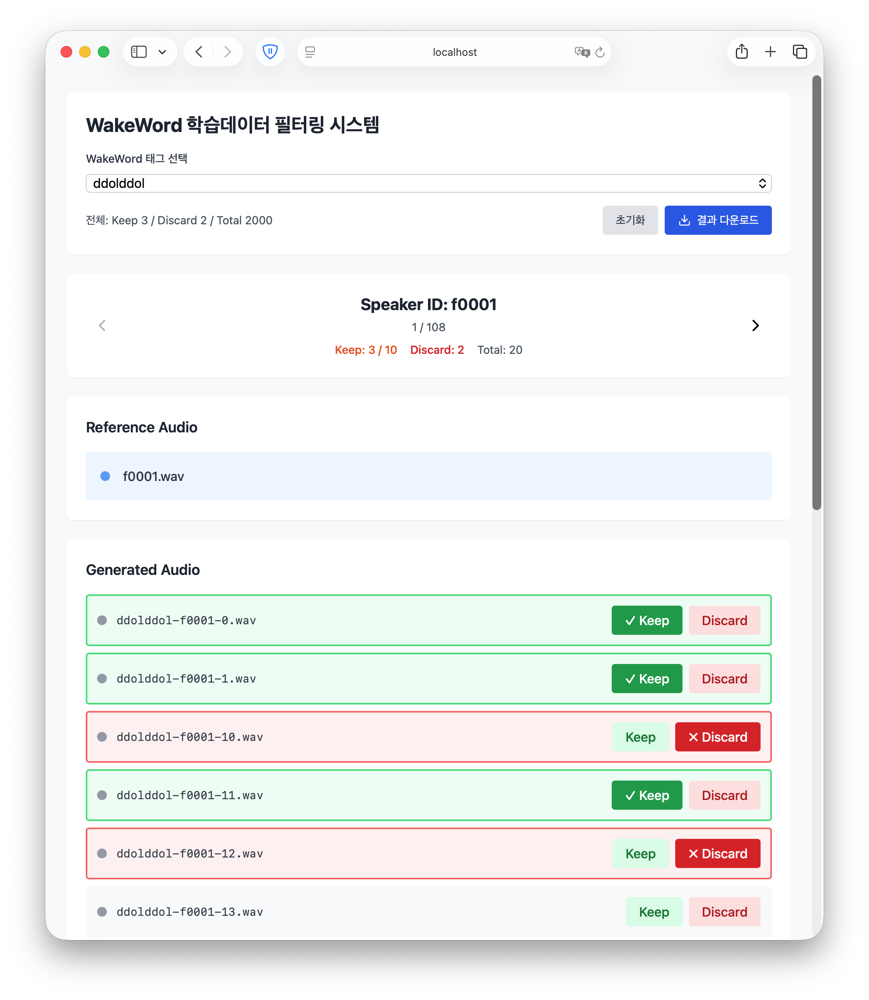

## 1. WakeWord 음성합성 (higgs-audio 사용)

([Original README](../README.md)를 따라 higgs-audio 설치 후 진행)
```
cd generate_wakewords
mkdir generated_outputs

python3 ./generation_aao.py --wakeword WAKEWORD --wakeword_tag WAKEWORD_TAG
```

**generation 테스트**
```
python3 ./geneartion.py
```

## 2. 데이터 필터링 WebUI 실행

```
conda install fastapi uvicorn

python ./server.py
```


## 3. 필터된 데이터 복사 및 샘플레이트 16kHz 변환

```
python process_dataset.py WAKEWORD_TAG
```

**./filtered_dataset/WAKEWORD_TAG 디렉터리에 학습데이터셋이 최종 생성됨**